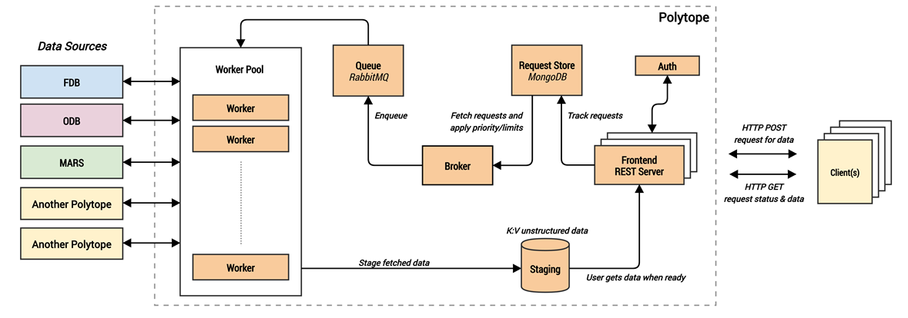

.. _design:

Design
======

Polytope has been designed to be portable and elastically scalable, following a micro-service architecture, while preserving its ability to be deployed as a bare set of processes on a local host for testing purposes.

A *frontend* microservice listens for requests and registers them in a centralised data base (*request store*).

A *broker* constantly checks the request store for new requests and, once a new request is identified, it is put in a *queue* for dispatching onto a *worker*. Requests are dispatched on a first come first served basis, but subject to quality-of-service limits.

Once a worker receives a request, it examines the request and activates the machinery and protocols to retrieve/archive the requested data from the corresponding data source. Upon failure the worker flags the request as failed in the request store. Upon success, the worker stores the retrieved data into a distributed data storage (*staging*), and flags the request as succeeded.

All along this process, a client can keep sending status query requests to the frontend for a previously submitted request. The frontend will check the status in the database and respond accordingly. When data is ready in staging, the frontend will also respond with a redirection to the URL to staging for the client to pull the data.

While revocation of requests is possible, they will not be interrupted once they have been dispatched to the corresponding datasource. Once a request is revoked, its data is removed from staging and de-indexed from the request data base. A *garbage collector* service cleans data in staging after a certain expiry period, or sooner if the staging storage is getting full.

A *telemetry* microservice collects important metrics from the other services, and makes them available at ``/telemetry/v1/``.

Polytope has an *authentication* module for connecting to external services as well as a plain text provider for testing purposes, but usually Polytope is connected to external authentication services via [Auth-o-tron](https://github.com/ecmwf/auth-o-tron) instead.

Most of the components in Polytope are configurable via a YAML configuration file that must be provided at deployment time. This configuration file specifies the URLs for all of the microservices, various options and parameters for how these services run, and may also contain configuration used by the deployment mechanism (e.g. number of service replicas). See :ref:`deployment` and :ref:`server_configuration` for details.
